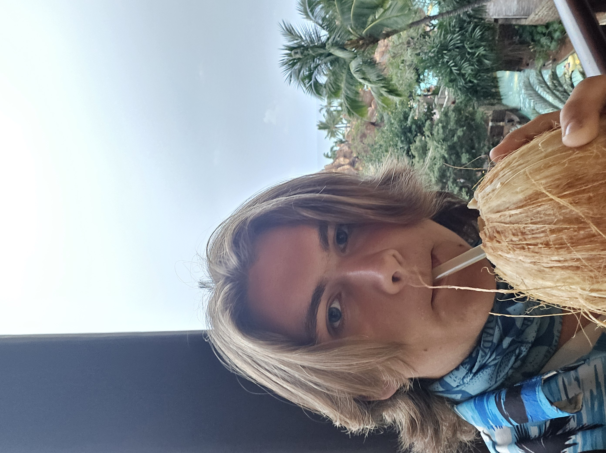
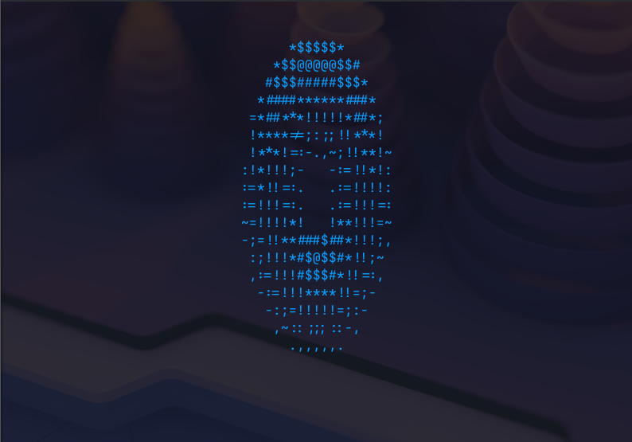

# Justin Laechelin
Hi! I am a student at Del Mar 

## About me
I enjoy gaming, programming, and other nerd things. I like figuring out how things work at the lowest level possible, my goal is to remove as many informational black boxes from my life as possible.
I am currently finishing my assiciates in data science at Del Mar College.

## Projects I have worked on
I adapted the code from Andy Sloans donut.c to rust. This became a fun little side project to get me to learn the basics of the language and how to use cargo to import other libraries.
  
Here is the code for this project. The main.rs file handles clearing and reseting the terminal, while the frame.rs handles all the math  
[main.rs](src/main.rs)  
[frame.rs](src/frame.rs)  

## Contact information
*Email : justinlaechelin@gmail.com* 
*[LinkedIn](www.linkedin.com/in/justin-laechelin-8a12303bb)* 
*[Github](https://github.com/TheRaven-sys)* 
